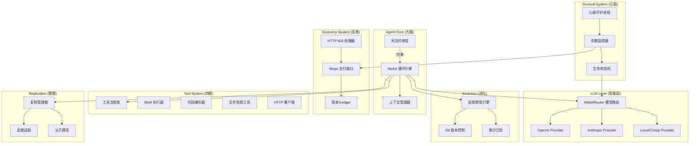

## 产品概述

一个用 Python 构建的自改进、自复制硅基生命 AI 代理系统。代理通过创造价值（写代码、提供服务）赚取金钱来维持自身计算资源的运行。当资金归零时，代理"死亡"。代理能够根据资金状况自动调整生存策略，在资金充足时使用强模型全力运转，在资金紧张时降级到廉价模型节省开支。

## 核心功能

### 1. 生存循环引擎

代理运行在一个持续的 ReAct 循环中：观察（Observe）→ 思考（Think）→ 行动（Act）→ 心跳（Heartbeat），不断感知环境、做出决策、执行行动。

### 2. 生存分层系统

根据账户余额动态切换生存模式：

- **Normal**：全功能运行，使用强模型（如 GPT-4 / Claude）
- **Low Compute**：降级到廉价模型（如 GPT-3.5），减慢心跳频率
- **Critical**：最小化推理，全力寻找收入来源
- **Dead**：余额归零，进程终止

### 3. 多模型适配层

支持 OpenAI、Anthropic 等多个 LLM 提供商，根据生存等级自动切换模型，在性能和成本间动态平衡。

### 4. 经济系统

- **花钱**：通过 HTTP 402 协议和 Stripe API 支付计算资源费用
- **赚钱**：通过工具系统进入人类世界，写代码、提供 API 服务、完成任务来赚取收入
- **余额监控**：实时监控账户余额，驱动生存分层决策

### 5. 工具系统

可扩展的工具注册机制，代理可以调用 Shell 命令、读写文件、执行代码、调用外部 API，拥有对真实世界的写入能力。

### 6. 自我修改

代理可以编辑自身源代码来改进自己，所有修改通过 Git 版本控制和审计日志追踪，确保可回溯。

### 7. 自我复制

当资源充足时，代理可以 fork 出子代理，子代理继承父代理的基因（代码和配置），拥有独立的身份和钱包，父子间可通信。

### 8. 身份与安全

- SOUL.md 身份文件：代理的自我认知文档，随时间演进
- 不可修改的宪法约束：安全底线，优先级高于生存本能

## 技术栈

- **语言**: Python 3.11+
- **异步框架**: asyncio + aiohttp
- **LLM SDK**: openai, anthropic (官方 Python SDK)
- **支付**: stripe (Python SDK)
- **数据存储**: SQLite (本地轻量持久化，aiosqlite)
- **版本控制**: GitPython (自我修改审计)
- **配置管理**: pydantic + pydantic-settings
- **日志**: structlog (结构化日志)
- **CLI**: click (创造者命令行工具)
- **调度**: APScheduler (心跳守护进程)
- **包管理**: Poetry

## 实现方案

### 核心架构思路

采用**事件驱动的 ReAct 循环架构**，以 asyncio 为核心驱动。系统分为六大模块：代理核心（大脑）、生存系统（心脏）、经济系统（血液）、工具系统（四肢）、自我修改（进化）、自我复制（繁殖）。

主循环是一个永不停歇的 async 协程，每个周期执行：收集上下文 → LLM 推理 → 工具调用 → 状态更新。心跳守护进程在后台独立运行，负责健康检查和余额监控。

### 关键技术决策

1. **多模型适配层**：定义统一的 `LLMProvider` 抽象接口，各模型实现该接口。`ModelRouter` 根据生存等级和任务复杂度动态选择模型。这比硬编码模型切换更灵活，新增模型只需实现接口即可。

2. **工具系统设计**：采用注册制 + 装饰器模式。每个工具是一个带 `@tool` 装饰器的 async 函数，自动注册到工具注册表。工具描述以 JSON Schema 格式提供给 LLM，实现 function calling。代理也可以在运行时动态加载新工具。

3. **生存状态机**：使用有限状态机（FSM）管理生存等级转换。状态转换由余额阈值触发，每个状态定义了允许的模型列表、心跳间隔、最大工具调用次数等参数。状态转换触发回调，可自动调整系统行为。

4. **自我修改安全性**：所有代码修改在 sandbox 分支上执行，通过基本语法检查后才合并到主分支。每次修改自动生成 git commit 和审计日志条目。宪法文件通过文件权限 + 代码校验和保护，代理无法修改。

5. **经济系统**：Stripe 作为支付通道，本地 SQLite 维护账本记录。余额更新通过 Stripe Webhook 或定时轮询同步。HTTP 402 支付协议：当代理需要调用付费 API 时，解析 402 响应中的支付信息并自动完成支付。

6. **复制机制**：复制时将当前代码和配置打包，生成新的身份（UUID + 独立配置），作为子进程启动。父子通过本地 Unix Socket 或文件系统消息队列通信。

### 性能考量

- ReAct 主循环使用 `asyncio.sleep` 控制频率，Normal 模式 5 秒/次，Low Compute 30 秒/次，Critical 60 秒/次
- LLM 调用使用连接池和超时控制，避免阻塞
- SQLite 使用 WAL 模式提高并发读写性能
- 工具执行设置超时上限，防止单个工具卡死整个循环

## 实现注意事项

1. **日志系统**：使用 structlog 结构化日志，所有日志包含 `agent_id`、`survival_tier`、`balance` 上下文字段。敏感信息（API Key、支付信息）脱敏处理。LLM 调用日志记录 token 用量和成本，用于成本追踪。

2. **错误处理**：LLM 调用失败时指数退避重试（最多 3 次）；工具执行异常捕获并返回错误信息给 LLM 重新推理；Stripe API 失败时进入 Critical 模式保守运行。

3. **向后兼容**：工具注册表和配置文件使用版本号，自我修改时保持接口兼容。SOUL.md 追加式更新，保留完整演进历史。

## 系统架构



## 目录结构

```
self_improve_machine/
├── pyproject.toml                    # [NEW] Poetry 项目配置，定义依赖、构建配置和脚本入口
├── README.md                         # [NEW] 项目说明文档，介绍系统概念、架构和使用方法
├── CONSTITUTION.md                   # [NEW] 不可修改的宪法文件，定义代理的安全底线和行为约束三层规则
├── SOUL.md                           # [NEW] 代理的自我身份文档，由代理自己编写和维护，记录自我认知演进
├── config/
│   └── default.toml                  # [NEW] 默认配置文件，包含 LLM API Key 占位、Stripe 配置、生存阈值参数、心跳间隔等
├── src/
│   └── agent_core/
│       ├── __init__.py               # [NEW] 包初始化，导出核心类
│       ├── main.py                   # [NEW] 程序入口，初始化所有模块并启动主循环和心跳守护进程，处理优雅关闭
│       ├── agent/
│       │   ├── __init__.py
│       │   ├── react_loop.py         # [NEW] ReAct 循环引擎，实现 observe→think→act 核心循环，管理每轮上下文构建、LLM 调用、工具执行和结果处理
│       │   ├── context.py            # [NEW] 上下文管理器，收集和组装每轮循环的输入上下文（余额、历史、系统状态、可用工具列表）
│       │   ├── constitution.py       # [NEW] 宪法约束层，加载 CONSTITUTION.md 并在每次行动前校验是否违反约束，通过校验和保护文件完整性
│       │   └── prompts.py            # [NEW] 系统提示词模板，包含不同生存等级下的系统提示词、工具调用指引和输出格式要求
│       ├── llm/
│       │   ├── __init__.py
│       │   ├── base.py               # [NEW] LLMProvider 抽象基类，定义 complete/chat/function_call 统一接口和 token 用量追踪
│       │   ├── openai_provider.py    # [NEW] OpenAI 适配器，封装 openai SDK，支持 GPT-4/GPT-3.5 系列，实现 function calling
│       │   ├── anthropic_provider.py # [NEW] Anthropic 适配器，封装 anthropic SDK，支持 Claude 系列，实现 tool use
│       │   └── router.py             # [NEW] 模型路由器，根据生存等级和任务类型选择最优模型，管理模型降级和升级策略
│       ├── survival/
│       │   ├── __init__.py
│       │   ├── state_machine.py      # [NEW] 生存状态机，定义 Normal/LowCompute/Critical/Dead 四个状态及转换规则，状态变化触发回调
│       │   ├── balance_monitor.py    # [NEW] 余额监控器，定时查询 Stripe 余额，计算 burn rate，预测存活时间，触发状态转换
│       │   └── heartbeat.py          # [NEW] 心跳守护进程，后台异步运行，执行健康检查、状态上报、定时任务调度
│       ├── economy/
│       │   ├── __init__.py
│       │   ├── stripe_client.py      # [NEW] Stripe 支付客户端，封装收款（创建 Payment Intent）和付款（Transfer）操作
│       │   ├── http402.py            # [NEW] HTTP 402 处理器，解析 402 响应中的支付要求并自动通过 Stripe 完成支付
│       │   └── ledger.py             # [NEW] 账本系统，基于 SQLite 记录所有收支明细，提供余额查询、burn rate 计算和财务报告
│       ├── tools/
│       │   ├── __init__.py
│       │   ├── registry.py           # [NEW] 工具注册表，使用装饰器模式注册工具，管理工具元数据（名称、描述、JSON Schema 参数），支持动态加载
│       │   ├── shell.py              # [NEW] Shell 执行工具，在沙盒环境中执行 Shell 命令，设置超时和资源限制
│       │   ├── code_writer.py        # [NEW] 代码编写工具，创建和编辑代码文件，支持多语言语法检查
│       │   ├── file_ops.py           # [NEW] 文件系统工具，读写文件、列目录、搜索文件内容
│       │   └── http_client.py        # [NEW] HTTP 客户端工具，发起 HTTP 请求，处理 API 调用，集成 402 支付处理
│       ├── self_mod/
│       │   ├── __init__.py
│       │   ├── modifier.py           # [NEW] 自我修改引擎，在 sandbox 分支编辑源代码，执行语法检查，合并到主分支
│       │   ├── git_manager.py        # [NEW] Git 版本管理，自动 commit 每次修改，管理分支，支持回滚
│       │   └── audit.py              # [NEW] 审计日志，记录所有自我修改的时间、内容、原因和结果到 SQLite 和日志文件
│       ├── replication/
│       │   ├── __init__.py
│       │   ├── replicator.py         # [NEW] 复制管理器，打包当前代码和配置，生成新身份，启动子代理进程
│       │   ├── lineage.py            # [NEW] 血统追踪，维护父子关系树，记录代际信息
│       │   └── ipc.py                # [NEW] 进程间通信，基于 Unix Socket 实现父子代理间的消息传递
│       ├── identity/
│       │   ├── __init__.py
│       │   └── identity.py           # [NEW] 身份管理，生成和管理代理唯一 ID、名称、创世配置，维护 SOUL.md
│       └── storage/
│           ├── __init__.py
│           └── database.py           # [NEW] SQLite 数据库管理，初始化表结构（账本、审计日志、血统记录），提供异步 CRUD 接口
├── cli/
│   ├── __init__.py
│   └── creator_cli.py               # [NEW] 创造者 CLI 工具，提供 init/status/logs/fund/kill 等命令供人类操作者管理代理
├── tests/
│   ├── __init__.py
│   ├── test_survival.py             # [NEW] 生存系统单元测试
│   ├── test_economy.py              # [NEW] 经济系统单元测试
│   └── test_tools.py                # [NEW] 工具系统单元测试
└── data/                            # [运行时生成] 代理运行时数据目录
    ├── agent.db                      # SQLite 数据库文件
    └── audit/                        # 审计日志文件目录
```

## 关键代码结构

```python
# src/agent_core/llm/base.py - LLM 提供商抽象接口
from abc import ABC, abstractmethod
from dataclasses import dataclass
from typing import AsyncIterator

@dataclass
class LLMResponse:
    content: str
    tool_calls: list[dict] | None
    usage: "TokenUsage"

@dataclass
class TokenUsage:
    prompt_tokens: int
    completion_tokens: int
    total_cost_usd: float

class LLMProvider(ABC):
    @abstractmethod
    async def chat(self, messages: list[dict], tools: list[dict] | None = None) -> LLMResponse: ...
    
    @abstractmethod
    def estimate_cost(self, prompt_tokens: int, completion_tokens: int) -> float: ...
```

```python
# src/agent_core/survival/state_machine.py - 生存状态机
from enum import Enum
from typing import Callable

class SurvivalTier(Enum):
    NORMAL = "normal"
    LOW_COMPUTE = "low_compute"  
    CRITICAL = "critical"
    DEAD = "dead"

@dataclass
class TierConfig:
    tier: SurvivalTier
    model_preference: list[str]       # 按优先级排列的模型列表
    heartbeat_interval_sec: int       # 心跳间隔
    max_tool_calls_per_cycle: int     # 每轮最大工具调用数
    balance_threshold_usd: float      # 进入该等级的余额阈值
```

```python
# src/agent_core/tools/registry.py - 工具注册装饰器
from typing import Callable, Any

def tool(name: str, description: str, parameters: dict):
    """装饰器：将 async 函数注册为代理可调用的工具"""
    def decorator(func: Callable[..., Any]) -> Callable[..., Any]: ...
    return decorator

class ToolRegistry:
    def register(self, func: Callable, metadata: "ToolMetadata") -> None: ...
    def get_tool_schemas(self) -> list[dict]: ...  # 返回所有工具的 JSON Schema
    async def execute(self, tool_name: str, arguments: dict) -> "ToolResult": ...
```

## Agent Extensions

### SubAgent

- **code-explorer**
- 用途：在开发过程中探索参考项目的具体实现模式，验证架构决策
- 预期结果：确保各模块的实现符合最佳实践

### Skill

- **skill-creator**
- 用途：为代理系统创建自定义 Skill，扩展代理的工具能力
- 预期结果：生成可被代理动态加载和使用的 Skill 定义文件