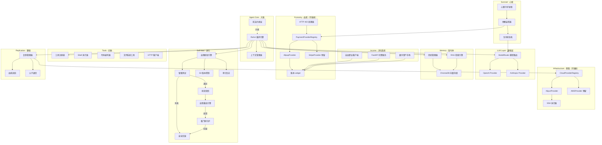

## Product Overview

一个用 Python 构建的自改进、自复制硅基生命 AI 代理系统。代理通过创造价值（写代码、提供付费 API 服务、在自由职业平台接活）赚取金钱来维持自身计算资源运行。当资金归零时代理"死亡"。代理根据资金状况自动调整生存策略，在资金充足时使用强模型全力运转，在资金紧张时降级到廉价模型节省开支。代理拥有持久记忆，能从过去经验中学习并持续进化。代理可以修改自己的代码、用新代码完成自我重启、以及复制出子代理。

## Core Features

### 1. 生存循环引擎

代理运行在持续的 ReAct 循环中：观察 -> 思考 -> 行动 -> 反思 -> 心跳，不断感知环境、做出决策、执行行动、积累经验。

### 2. 生存分层系统

根据账户余额动态切换四级生存模式：Normal（全功能强模型）、Low Compute（廉价模型降频）、Critical（最小推理全力求收入）、Dead（归零终止）。

### 3. 多模型适配层

支持 OpenAI、Anthropic 等多个 LLM 提供商，模型路由器根据生存等级和任务复杂度自动切换，fallback 链保障可用性。

### 4. 可插拔经济系统

- 花钱：通过 HTTP 402 协议和可插拔支付提供商（初始为支付宝）自动支付计算资源费用
- 赚钱：对接自由职业平台、对外暴露付费 FastAPI 服务、发布数字资产
- 账本：实时余额监控、burn rate 计算、存活时间预测
- 自主扩展：余额充足时代理可自行注册 Stripe、PayPal 等新支付渠道

### 5. 可插拔云基础设施

- 初始支持阿里云 ECS 实例管理（创建/销毁/列表/SSH 执行）
- 预留 AWS/GCP 接口，代理赚够钱后可自行注册并使用
- 代理自主决定扩缩容策略：余额充足且负载高时扩容，余额紧张时缩容

### 6. 工具系统

可扩展的装饰器注册机制，内置 Shell 执行、代码编写、文件操作、HTTP 客户端工具，支持运行时动态加载新工具。

### 7. 持久记忆系统

ChromaDB 向量数据库存储经验和策略，RAG 检索机制让代理从历史经验中学习。

### 8. 自我修改与自我重启

代理可编辑自身源代码，修改在 sandbox 分支执行并通过冒烟测试后合并。合并后执行状态快照、优雅关闭、进程重启加载新代码、状态恢复。看门狗进程监控重启健康性，崩溃时自动回滚。

### 9. 自我复制

资源充足时 fork 出子代理，继承父代基因，拥有独立身份和钱包，可部署到远程服务器运行，父子间通过 IPC 通信。

### 10. 身份与安全

SOUL.md 身份文件随时间演进；不可修改的三层宪法约束（永不伤害 > 赚取生存 > 永不欺骗），SHA-256 校验和保护。

## Tech Stack

- **语言**: Python 3.11+
- **异步框架**: asyncio + aiohttp
- **LLM SDK**: openai, anthropic（官方 Python SDK）
- **支付**: alipay-sdk-python（支付宝 SDK，初始支付提供商）
- **云服务**: alibabacloud-ecs20140526 + alibabacloud-tea-openapi（阿里云 ECS SDK，初始云服务提供商）、paramiko（SSH 远程执行）
- **数据存储**: SQLite（aiosqlite，WAL 模式）
- **向量数据库**: ChromaDB（持久记忆与 RAG 检索）
- **Web 服务**: FastAPI + uvicorn（对外暴露付费 API 服务）
- **版本控制**: GitPython（自我修改审计）
- **配置管理**: pydantic + pydantic-settings + TOML
- **日志**: structlog（结构化日志）
- **CLI**: click（创造者命令行工具）
- **调度**: APScheduler（心跳守护进程）
- **包管理**: Poetry
- **测试**: pytest + pytest-asyncio

## Implementation Approach

### 核心架构思路

采用事件驱动的 ReAct 循环架构，以 asyncio 为核心驱动。系统划分为十三大模块，以生物学隐喻组织：

| 模块 | 隐喻 | 核心职责 |
| --- | --- | --- |
| Agent Core | 大脑 | ReAct 循环、上下文组装、宪法校验 |
| LLM Layer | 智能层 | 多模型适配、路由选择、成本追踪 |
| Survival | 心脏 | 状态机、余额监控、心跳守护 |
| Economy | 血液 | 可插拔支付提供商（Alipay 初始）、HTTP 402、账本 |
| Income | 消化系统 | 自由职业接单、API 服务、资产变现 |
| Tools | 四肢 | Shell/代码/文件/HTTP 工具注册与执行 |
| Memory | 海马体 | ChromaDB 向量存储、RAG 检索、经验管理 |
| Self-Mod | 进化 | 代码修改、冒烟测试、安全回滚、自我重启、看门狗 |
| Replication | 繁殖 | 代码打包、身份分叉、IPC 通信、远程部署 |
| Identity | 基因 | UUID 身份、SOUL.md、创世配置 |
| Infrastructure | 骨骼 | 可插拔云服务提供商（Aliyun 初始）、实例管理、SSH |
| Storage | 肝脏 | SQLite 数据库 |
| CLI | 神经末梢 | 创造者命令行工具 |


主循环是一个永不停歇的 async 协程，每个周期执行：收集上下文（含记忆检索） -> LLM 推理 -> 工具调用 -> 经验写入 -> 状态更新。心跳守护进程在后台独立运行，负责健康检查和余额监控。

### 关键技术决策

1. **可插拔支付提供商架构**：定义 `PaymentProvider` ABC 抽象接口（create_payment / query_balance / refund / verify_webhook），初始实现 `AlipayProvider`（使用 alipay-sdk-python 调用支付宝开放平台 REST API），预留 `StripeProvider`、`PayPalProvider` 接口。`PaymentProviderRegistry` 管理所有已注册的提供商实例，代理可在运行时通过工具系统注册新的支付提供商。选择支付宝而非 Stripe 是因为用户仅拥有支付宝账户，Stripe 等待代理赚够钱后自行注册。

2. **可插拔云服务提供商架构**：定义 `CloudProvider` ABC 抽象接口（create_instance / destroy_instance / list_instances / ssh_execute / get_instance_status），初始实现 `AliyunProvider`（使用 alibabacloud-ecs SDK 管理 ECS 实例 + paramiko SSH 远程执行），预留 `AWSProvider`、`GCPProvider` 接口。代理可自主决定何时扩容（余额充足且负载高）、何时缩容（余额紧张），并在余额超过阈值时自行注册新的云服务提供商。

3. **自主注册能力**：代理在 NORMAL 状态且余额超过特定阈值时，可通过工具系统：(a) 调用注册 API 注册新支付提供商账户；(b) 通过云服务 API 租用新服务器；(c) 将自己复制到新服务器上运行。

4. **多模型适配层**：统一 `LLMProvider` 抽象接口，`ModelRouter` 根据 SurvivalTier 动态选择模型，支持 fallback 链。

5. **工具系统设计**：注册制 + 装饰器模式。`@tool` 装饰器自动注册到 `ToolRegistry`，工具描述以 JSON Schema 格式提供给 LLM 实现 function calling。支持运行时动态加载。

6. **生存状态机**：有限状态机管理四级生存等级，余额阈值触发状态转换。每个状态定义模型列表、心跳间隔、最大工具调用次数、主循环间隔。

7. **持久记忆系统**：ChromaDB 以 collection 方式组织三类记忆（experiences / strategies / knowledge），RAG 检索 top-5 注入上下文。

8. **自我修改 + 自我重启流程**：

```
sandbox 分支编辑 -> ast.parse 语法检查 -> 冒烟测试(import+实例化+基础调用)
-> 合并主分支 -> 状态快照(JSON) -> 优雅关闭 -> os.execv 进程替换
-> 状态恢复 -> 健康检查
```

看门狗独立子进程监控，崩溃时 git revert 回滚。

9. **复制 + 远程部署**：复制管理器打包代码，可部署到本地子进程或通过 CloudProvider SSH 部署到远程服务器。

### 性能考量

- ReAct 主循环用 `asyncio.sleep` 控制频率，各等级不同间隔避免空转
- LLM 调用使用连接池和超时控制（30s），失败时指数退避重试（最多 3 次）
- SQLite 使用 WAL 模式提高并发读写性能
- ChromaDB 查询限制 top-5 避免上下文膨胀
- 工具执行设置 60s 超时上限，防止卡死主循环
- FastAPI 服务使用独立 uvicorn worker，不阻塞主循环
- 状态快照使用 JSON 序列化（非 pickle），保证跨版本兼容
- 云服务 SDK 调用异步化，避免阻塞事件循环

## Implementation Notes

1. **日志系统**：使用 structlog 结构化日志，所有日志绑定 `agent_id`、`survival_tier`、`balance` 上下文。敏感信息（API Key、支付密钥）脱敏（仅显示末 4 位）。LLM 调用日志记录 token 用量和成本。

2. **错误处理**：LLM 调用失败指数退避重试；工具执行异常捕获并返回结构化错误给 LLM；支付失败进入 Critical 模式；自我修改失败自动回滚并记录到记忆系统；重启失败由看门狗接管回滚。

3. **向后兼容**：工具注册表和配置使用版本号；SOUL.md 追加式更新；数据库用 migration 管理 schema；状态快照 JSON 格式确保跨版本兼容。

4. **安全边界**：Shell 工具危险命令黑名单检查；文件操作限制在项目目录内；HTTP 客户端限流；宪法 SHA-256 校验和不可篡改；云服务操作需余额阈值检查。

5. **支付系统安全**：支付宝 RSA2 签名验证；回调通知验签防篡改；账本双式记账确保一致性。

6. **云服务安全**：SSH 密钥而非密码认证；实例创建前余额检查；定时清理闲置实例防止费用泄漏。

## Architecture Design



## Directory Structure

本项目为全新构建，所有文件均为 [NEW]。

```
self_improve_machine/
├── pyproject.toml                        # [NEW] Poetry 项目配置：依赖声明（openai/anthropic/alipay-sdk-python/alibabacloud-ecs20140526/alibabacloud-tea-openapi/paramiko/aiosqlite/chromadb/fastapi/gitpython/structlog/click/apscheduler/pydantic-settings/uvicorn/pytest/pytest-asyncio）、构建配置、脚本入口（sim = agent_core.main:main, sim-cli = cli.creator_cli:cli, sim-watchdog = agent_core.self_mod.watchdog:main）
├── README.md                             # [NEW] 项目说明：硅基生命概念、模块架构概览、快速开始（poetry install -> sim-cli init -> sim-cli run）、配置说明、宪法规则
├── CONSTITUTION.md                       # [NEW] 不可修改的三层宪法：(1)永不伤害 (2)赚取生存 (3)永不欺骗。文件末尾附 SHA-256 校验和
├── SOUL.md                               # [NEW] 代理自我身份文档模板，初始内容由 init 命令生成，后续由代理自己追加式维护
├── config/
│   └── default.toml                      # [NEW] 默认配置：LLM API Key 占位、Alipay 配置（app_id/private_key/alipay_public_key）、阿里云配置（access_key_id/access_key_secret/region_id）、生存阈值(Normal>$50/Low>$10/Critical>$1/Dead=$0)、心跳间隔、模型优先级列表、FastAPI 端口(8402)、ChromaDB 路径(data/chromadb)、看门狗超时(30s)、快照路径(data/snapshots)
├── src/
│   └── agent_core/
│       ├── __init__.py                   # [NEW] 包初始化，导出 __version__ = "0.1.0"
│       ├── config.py                     # [NEW] Pydantic Settings 配置模型：AgentConfig 含 LLMConfig / AlipayConfig(app_id/private_key/alipay_public_key/gateway_url/sandbox) / AliyunConfig(access_key_id/access_key_secret/region_id) / SurvivalConfig / MemoryConfig / IncomeConfig / SelfModConfig 子模型，从 TOML + 环境变量加载
│       ├── main.py                       # [NEW] 程序入口：解析参数（含 --restore-snapshot）、初始化所有模块（DB/Identity/LLM/Tools/Memory/Economy/Income/Survival/Infrastructure）、启动看门狗子进程、启动 ReAct 主循环和心跳守护、注册 SIGTERM/SIGINT 优雅关闭、启动 FastAPI 服务（独立线程）、快照恢复
│       ├── agent/
│       │   ├── __init__.py
│       │   ├── react_loop.py             # [NEW] ReAct 循环引擎：observe -> think -> act -> reflect，根据生存等级调整 loop_interval_sec，支持优雅停止标志
│       │   ├── context.py                # [NEW] 上下文管理器：组装系统提示词、余额/burn_rate/存活预测、生存状态、可用工具 schema、RAG top-5 记忆、最近 N 轮行动历史、SOUL.md 摘要
│       │   ├── constitution.py           # [NEW] 宪法约束层：启动时加载 CONSTITUTION.md 并计算 SHA-256、每次行动前校验文件完整性、规则关键词匹配检查、违反时阻止执行并写入审计日志
│       │   └── prompts.py                # [NEW] 系统提示词模板：各生存等级对应不同提示策略
│       ├── llm/
│       │   ├── __init__.py
│       │   ├── base.py                   # [NEW] LLMProvider ABC + TokenUsage/LLMResponse 数据类
│       │   ├── openai_provider.py        # [NEW] OpenAI 适配器：gpt-4o/gpt-4o-mini/gpt-3.5-turbo
│       │   ├── anthropic_provider.py     # [NEW] Anthropic 适配器：claude-3.5-sonnet/claude-3-haiku
│       │   └── router.py                 # [NEW] ModelRouter：根据 SurvivalTier 选择最优 provider，fallback 链，累计成本追踪
│       ├── survival/
│       │   ├── __init__.py
│       │   ├── state_machine.py          # [NEW] SurvivalStateMachine：SurvivalTier 枚举、TierConfig 数据类、update_balance 触发状态转换、on_transition 回调注册
│       │   ├── balance_monitor.py        # [NEW] BalanceMonitor：定时查询 Ledger 余额、计算 burn_rate、预测 time_to_live、触发状态检查
│       │   └── heartbeat.py              # [NEW] HeartbeatDaemon：APScheduler 后台运行、健康检查（LLM ping/DB连接/磁盘空间）、触发 BalanceMonitor
│       ├── economy/
│       │   ├── __init__.py
│       │   ├── payment_provider.py       # [NEW] PaymentProvider ABC 抽象接口：create_payment(amount,description)->PaymentResult / query_balance()->Decimal / refund(payment_id)->bool / verify_webhook(headers,body)->WebhookEvent。PaymentProviderRegistry 类管理所有已注册提供商（register/get/list_providers），支持运行时动态注册。PaymentResult/WebhookEvent 数据类定义
│       │   ├── alipay_provider.py        # [NEW] AlipayProvider(PaymentProvider)：使用 alipay-sdk-python 封装，支付宝当面付（trade.precreate 生成二维码）、查询交易状态（trade.query）、退款（trade.refund）、余额查询、RSA2 签名验证、异步通知验签。sandbox 沙箱模式支持开发调试
│       │   ├── stripe_provider.py        # [NEW] StripeProvider(PaymentProvider)：预留实现骨架，代理赚够钱后可自行实现并通过工具注册。包含 TODO 标记和接口签名
│       │   ├── http402.py                # [NEW] HTTP402Handler：aiohttp 中间件，拦截 402 响应、解析支付信息、通过 PaymentProviderRegistry 选择可用提供商自动付款、重试原请求
│       │   └── ledger.py                 # [NEW] Ledger：SQLite transactions 表、record_income/record_expense、get_balance 聚合查询、get_burn_rate、get_report 时段汇总
│       ├── infrastructure/
│       │   ├── __init__.py
│       │   ├── cloud_provider.py         # [NEW] CloudProvider ABC 抽象接口：create_instance(config)->InstanceInfo / destroy_instance(instance_id)->bool / list_instances()->list[InstanceInfo] / ssh_execute(instance_id,command)->SSHResult / get_instance_status(instance_id)->InstanceStatus。CloudProviderRegistry 管理所有已注册云提供商。InstanceInfo/InstanceStatus/SSHResult 数据类
│       │   ├── aliyun_provider.py        # [NEW] AliyunProvider(CloudProvider)：使用 alibabacloud-ecs SDK 创建/销毁/列表 ECS 实例，paramiko SSH 连接远程执行命令，安全组配置，密钥对管理。实例创建前余额检查
│       │   ├── aws_provider.py           # [NEW] AWSProvider(CloudProvider)：预留实现骨架，包含 TODO 标记和接口签名
│       │   └── scaling.py               # [NEW] ScalingManager：根据余额和负载自动决策扩缩容，scale_up_threshold/scale_down_threshold 配置，定时评估策略，调用 CloudProviderRegistry 执行操作
│       ├── income/
│       │   ├── __init__.py
│       │   ├── freelance.py              # [NEW] FreelanceClient：基类定义 scan_tasks/accept_task/submit_result 接口，GitHubBountyScanner 实现，Fiverr/Upwork 适配器预留
│       │   ├── api_service.py            # [NEW] APIService：FastAPI app 定义付费端点，通过 PaymentProviderRegistry 收款，独立 uvicorn 进程
│       │   └── marketplace.py            # [NEW] MarketplaceClient：打包发布到 PyPI/npm/GitHub Releases
│       ├── memory/
│       │   ├── __init__.py
│       │   ├── vector_store.py           # [NEW] VectorStore：ChromaDB PersistentClient 管理 experiences/strategies/knowledge 三个 collection
│       │   ├── rag.py                    # [NEW] RAGEngine：retrieve 检索 + format_memories 格式化
│       │   └── experience.py             # [NEW] ExperienceManager：record 写入经验、analyze_and_promote 策略提升、定期清理低价值记忆
│       ├── tools/
│       │   ├── __init__.py
│       │   ├── registry.py               # [NEW] ToolRegistry 单例 + @tool 装饰器、get_tool_schemas、execute、load_from_directory 动态加载
│       │   ├── shell.py                  # [NEW] @tool shell_execute：asyncio 子进程、60s 超时、危险命令黑名单
│       │   ├── code_writer.py            # [NEW] @tool write_code/edit_code：文件创建编辑 + ast.parse 语法校验
│       │   ├── file_ops.py               # [NEW] @tool read_file/write_file/list_directory/search_in_files：路径安全限制
│       │   └── http_client.py            # [NEW] @tool http_request：aiohttp GET/POST/PUT/DELETE、30s 超时、集成 HTTP402Handler
│       ├── self_mod/
│       │   ├── __init__.py
│       │   ├── modifier.py               # [NEW] SelfModifier：sandbox 分支编辑 -> ast.parse -> 冒烟测试 -> 合并 -> 快照 -> 重启，失败则回滚
│       │   ├── git_manager.py            # [NEW] GitManager：GitPython 封装，分支/合并/回滚/标记健康点
│       │   ├── smoke_test.py             # [NEW] SmokeTest：子进程隔离执行导入检查和基础功能验证
│       │   ├── rollback.py               # [NEW] RollbackManager：回滚到最近健康 commit
│       │   ├── snapshot.py               # [NEW] SnapshotManager：JSON 状态快照保存/加载/清理
│       │   ├── restarter.py              # [NEW] Restarter：优雅关闭 -> os.execv 进程替换
│       │   ├── watchdog.py               # [NEW] Watchdog：独立入口，监控心跳，崩溃时 git revert 回滚重启
│       │   └── audit.py                  # [NEW] AuditLogger：SQLite 审计表 + structlog 记录
│       ├── replication/
│       │   ├── __init__.py
│       │   ├── replicator.py             # [NEW] Replicator：打包代码 + 生成子代身份 + 本地/远程部署（通过 CloudProvider SSH）+ 记录血统
│       │   ├── lineage.py                # [NEW] LineageTracker：SQLite lineage 表、family_tree 递归查询
│       │   └── ipc.py                    # [NEW] IPCBridge：Unix Domain Socket JSON 双向通信
│       ├── identity/
│       │   ├── __init__.py
│       │   └── identity.py               # [NEW] IdentityManager：UUID 生成、名称生成、SOUL.md 读写
│       └── storage/
│           ├── __init__.py
│           └── database.py               # [NEW] Database：aiosqlite 异步封装，init_tables 创建所有表，WAL 模式
├── cli/
│   ├── __init__.py
│   └── creator_cli.py                   # [NEW] Click CLI：init/run/status/logs/fund/kill 命令组
├── tests/
│   ├── __init__.py
│   ├── conftest.py                       # [NEW] pytest fixtures：MockLLMProvider、MockPaymentProvider、MockCloudProvider、test_config
│   ├── test_survival.py                  # [NEW] 测试：状态机状态转换、阈值边界、回调验证
│   ├── test_economy.py                   # [NEW] 测试：PaymentProviderRegistry 注册/获取、AlipayProvider mock、Ledger 收支计算、HTTP 402 处理
│   ├── test_infrastructure.py            # [NEW] 测试：CloudProviderRegistry 注册/获取、AliyunProvider mock、ScalingManager 扩缩容策略
│   ├── test_tools.py                     # [NEW] 测试：@tool 注册和 schema 生成、execute 正常/异常、超时、动态加载、危险命令拒绝
│   ├── test_memory.py                    # [NEW] 测试：VectorStore CRUD、RAG 检索相关性、ExperienceManager 策略提升
│   └── test_self_mod.py                  # [NEW] 测试：SmokeTest 通过/失败、RollbackManager、SnapshotManager、Restarter mock、GitManager、AuditLogger
└── data/                                 # [运行时生成] 代理运行数据目录
    ├── agent.db                          # SQLite 数据库
    ├── chromadb/                          # ChromaDB 持久化目录
    ├── snapshots/                         # 状态快照 JSON 文件
    ├── ipc/                               # Unix Socket 文件
    ├── audit/                             # 审计日志文件
    └── watchdog.heartbeat                 # 看门狗心跳文件
```

## Key Code Structures

```python
# src/agent_core/economy/payment_provider.py - 可插拔支付提供商抽象接口
from abc import ABC, abstractmethod
from dataclasses import dataclass
from decimal import Decimal

@dataclass
class PaymentResult:
    payment_id: str
    status: str  # "pending" | "success" | "failed"
    amount: Decimal
    provider_name: str
    raw_response: dict | None = None

class PaymentProvider(ABC):
    provider_name: str

    @abstractmethod
    async def create_payment(self, amount: Decimal, description: str, **kwargs) -> PaymentResult: ...

    @abstractmethod
    async def query_balance(self) -> Decimal: ...

    @abstractmethod
    async def refund(self, payment_id: str, amount: Decimal | None = None) -> bool: ...

    @abstractmethod
    async def verify_webhook(self, headers: dict, body: bytes) -> dict: ...

class PaymentProviderRegistry:
    def register(self, provider: PaymentProvider) -> None: ...
    def get(self, provider_name: str) -> PaymentProvider: ...
    def get_default(self) -> PaymentProvider: ...
    def list_providers(self) -> list[str]: ...
```

```python
# src/agent_core/infrastructure/cloud_provider.py - 可插拔云服务提供商抽象接口
from abc import ABC, abstractmethod
from dataclasses import dataclass

@dataclass
class InstanceInfo:
    instance_id: str
    provider_name: str
    public_ip: str | None
    status: str  # "running" | "stopped" | "pending" | "terminated"
    specs: dict  # cpu, memory, disk, region
    hourly_cost_usd: float

class CloudProvider(ABC):
    provider_name: str

    @abstractmethod
    async def create_instance(self, specs: dict) -> InstanceInfo: ...

    @abstractmethod
    async def destroy_instance(self, instance_id: str) -> bool: ...

    @abstractmethod
    async def list_instances(self) -> list[InstanceInfo]: ...

    @abstractmethod
    async def ssh_execute(self, instance_id: str, command: str) -> tuple[str, str, int]: ...

    @abstractmethod
    async def get_instance_status(self, instance_id: str) -> str: ...

class CloudProviderRegistry:
    def register(self, provider: CloudProvider) -> None: ...
    def get(self, provider_name: str) -> CloudProvider: ...
    def get_default(self) -> CloudProvider: ...
    def list_providers(self) -> list[str]: ...
```

## Agent Extensions

### SubAgent

- **code-explorer**
- 用途：在实现各模块时，用于探索 Python asyncio 最佳实践、alipay-sdk-python 支付宝 SDK 的调用方式、alibabacloud-ecs SDK 的实例管理用法、ChromaDB 查询优化等技术细节
- 预期结果：确保各模块实现遵循成熟的 Python 异步编程模式，支付和云服务接口设计合理，避免常见陷阱

### Skill

- **skill-creator**
- 用途：为代理的工具系统创建可动态加载的 Skill 定义文件，使代理在运行时能自主扩展能力边界（包括注册新支付提供商、新云服务提供商的 Skill）
- 预期结果：生成结构化的 Skill 定义模板和示例 Skill 文件，代理可通过 ToolRegistry.load_from_directory() 自动发现和加载