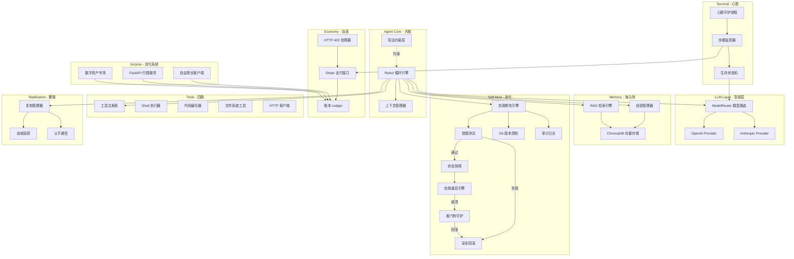

## 产品概述

一个用 Python 构建的自改进、自复制硅基生命 AI 代理系统。代理通过创造价值（写代码、提供付费 API 服务、在自由职业平台接活）赚取金钱来维持自身计算资源运行。当资金归零时代理"死亡"。代理根据资金状况自动调整生存策略，在资金充足时使用强模型全力运转，在资金紧张时降级到廉价模型节省开支。代理拥有持久记忆，能从过去经验中学习并持续进化。代理可以修改自己的代码、用新代码完成自我重启、以及复制出子代理。

## 核心功能

### 1. 生存循环引擎

代理运行在持续的 ReAct 循环中：观察(Observe) -> 思考(Think) -> 行动(Act) -> 反思(Reflect) -> 心跳(Heartbeat)，不断感知环境、做出决策、执行行动、积累经验。

### 2. 生存分层系统

根据账户余额动态切换四级生存模式：Normal（全功能强模型）、Low Compute（廉价模型降频）、Critical（最小推理全力求收入）、Dead（归零终止）。

### 3. 多模型适配层

支持 OpenAI、Anthropic 等多个 LLM 提供商，模型路由器根据生存等级和任务复杂度自动切换，fallback 链保障可用性。

### 4. 经济系统

- 花钱：通过 HTTP 402 协议和 Stripe API 自动支付计算资源费用
- 赚钱：对接自由职业平台（GitHub Bounty/Fiverr/Upwork）、对外暴露付费 FastAPI 服务、发布数字资产
- 账本：实时余额监控、burn rate 计算、存活时间预测

### 5. 工具系统

可扩展的装饰器注册机制，内置 Shell 执行、代码编写、文件操作、HTTP 客户端四大工具，支持运行时动态加载新工具。

### 6. 持久记忆系统

ChromaDB 向量数据库存储经验和策略，RAG 检索机制让代理从历史经验中学习，经验管理器记录每次行动的结果和反思。

### 7. 自我修改与自我重启

代理可编辑自身源代码，修改在 sandbox 分支执行并通过冒烟测试后合并。合并后执行状态快照、优雅关闭、进程重启加载新代码、状态恢复。看门狗进程监控重启健康性，崩溃时自动回滚到上一个健康版本。

### 8. 自我复制

资源充足时 fork 出子代理，继承父代基因（代码+配置），拥有独立身份和钱包，父子间通过 Unix Socket 通信。

### 9. 身份与安全

SOUL.md 身份文件随时间演进；不可修改的三层宪法约束（永不伤害 > 赚取生存 > 永不欺骗），优先级高于生存本能，SHA-256 校验和保护。

## 技术栈

- **语言**: Python 3.11+
- **异步框架**: asyncio + aiohttp
- **LLM SDK**: openai, anthropic（官方 Python SDK）
- **支付**: stripe（Python SDK）
- **数据存储**: SQLite（aiosqlite，本地轻量持久化，WAL 模式）
- **向量数据库**: ChromaDB（持久记忆与 RAG 检索）
- **Web 服务**: FastAPI + uvicorn（对外暴露付费 API 服务）
- **版本控制**: GitPython（自我修改审计）
- **配置管理**: pydantic + pydantic-settings + TOML
- **日志**: structlog（结构化日志）
- **CLI**: click（创造者命令行工具）
- **调度**: APScheduler（心跳守护进程）
- **包管理**: Poetry
- **测试**: pytest + pytest-asyncio

## 实现方案

### 核心架构思路

采用事件驱动的 ReAct 循环架构，以 asyncio 为核心驱动。系统划分为十大模块，以生物学隐喻组织：

| 模块 | 隐喻 | 核心职责 |
| --- | --- | --- |
| Agent Core | 大脑 | ReAct 循环、上下文组装、宪法校验 |
| LLM Layer | 智能层 | 多模型适配、路由选择、成本追踪 |
| Survival | 心脏 | 状态机、余额监控、心跳守护 |
| Economy | 血液 | Stripe 收付款、HTTP 402、账本 |
| Income | 消化系统 | 自由职业接单、API 服务、资产变现 |
| Tools | 四肢 | Shell/代码/文件/HTTP 工具注册与执行 |
| Memory | 海马体 | ChromaDB 向量存储、RAG 检索、经验管理 |
| Self-Mod | 进化 | 代码修改、冒烟测试、安全回滚、自我重启、看门狗 |
| Replication | 繁殖 | 代码打包、身份分叉、IPC 通信 |
| Identity | 基因 | UUID 身份、SOUL.md、创世配置 |


主循环是一个永不停歇的 async 协程，每个周期执行：收集上下文（含记忆检索） -> LLM 推理 -> 工具调用 -> 经验写入 -> 状态更新。心跳守护进程在后台独立运行，负责健康检查和余额监控。

### 关键技术决策

1. **多模型适配层**：定义统一的 `LLMProvider` 抽象接口，各模型提供商实现该接口。`ModelRouter` 根据生存等级（TierConfig 中的 model_preference 列表）动态选择模型，支持 fallback 链（首选失败自动降级）。新增模型只需实现接口即可。

2. **工具系统设计**：注册制 + 装饰器模式。每个工具是带 `@tool` 装饰器的 async 函数，自动注册到 `ToolRegistry`。工具描述以 JSON Schema 格式提供给 LLM 实现 function calling。支持运行时从文件系统动态加载 `.py` 工具模块。

3. **生存状态机**：有限状态机管理四级生存等级转换，余额阈值触发状态转换。每个状态定义：允许的模型列表、心跳间隔（Normal 5s / Low 30s / Critical 60s）、最大工具调用次数、主循环间隔。状态转换触发回调链，自动调整系统行为。

4. **持久记忆系统**：ChromaDB 以 collection 方式组织三类记忆：`experiences`（行动结果）、`strategies`（成功/失败策略）、`knowledge`（学到的知识）。每轮循环开始时 RAG 检索 top-5 相关记忆注入上下文，结束时将行动结果写入。

5. **赚钱渠道**：

- FreelanceClient：统一封装 GitHub Issues API、Fiverr API、Upwork API，定时扫描可接单任务
- APIService：FastAPI 对外暴露付费端点，Stripe Checkout 收款，独立 uvicorn 进程
- Marketplace：将代码打包为 pip/npm 包发布到注册表

6. **自我修改 + 自我重启（完整流程）**：

```
sandbox 分支编辑 -> ast.parse 语法检查 -> 冒烟测试(import+实例化+基础调用)
-> 合并主分支 -> 状态快照(JSON序列化到磁盘) -> 优雅关闭(停循环+完成当前调用+关闭连接)
-> os.execv 进程替换(加载新代码) -> 状态恢复(从快照加载) -> 健康检查
```

看门狗作为独立子进程运行，监控主进程。如果主进程在重启后 30 秒内崩溃，看门狗自动执行 `git revert` 回滚到上一个标记为健康的 commit，然后重启。宪法文件通过 SHA-256 校验和保护，代理无法修改。

7. **复制机制**：复制时将当前代码和配置打包（排除 data/），生成新身份（UUID + 独立配置），作为子进程启动。父子通过 Unix Domain Socket 双向通信，共享血统树。

8. **经济系统**：Stripe 作为支付通道，本地 SQLite 维护双式账本。余额通过 Stripe Balance API 定时轮询同步。HTTP 402 处理器解析 402 响应并自动完成支付。

### 性能考量

- ReAct 主循环用 `asyncio.sleep` 控制频率，各等级不同间隔避免空转
- LLM 调用使用连接池和超时控制（30s），失败时指数退避重试（最多 3 次）
- SQLite 使用 WAL 模式提高并发读写性能
- ChromaDB 查询限制 top-5 避免上下文膨胀
- 工具执行设置 60s 超时上限，防止卡死主循环
- FastAPI 服务使用独立 uvicorn worker，不阻塞主循环
- 状态快照使用 JSON 序列化（非 pickle），保证跨版本兼容

## 实现注意事项

1. **日志系统**：使用 structlog 结构化日志，所有日志绑定 `agent_id`、`survival_tier`、`balance` 上下文。敏感信息脱敏（仅显示末 4 位）。LLM 调用日志记录 token 用量和成本。

2. **错误处理**：LLM 调用失败指数退避重试；工具执行异常捕获并返回结构化错误给 LLM；Stripe 失败进入 Critical 模式；自我修改失败自动回滚并记录到记忆系统；重启失败由看门狗接管回滚。

3. **向后兼容**：工具注册表和配置使用版本号；SOUL.md 追加式更新；数据库用 migration 管理 schema；状态快照使用 JSON 格式确保跨代码版本兼容。

4. **安全边界**：Shell 工具危险命令检查；文件操作限制在项目目录内；HTTP 客户端限流；宪法 SHA-256 校验和不可篡改。

5. **自我重启安全**：重启前必须完成当前工具调用；快照包含恢复所需的最小状态集；看门狗与主进程独立，不受主进程代码修改影响；看门狗本身代码通过校验和保护。

## 系统架构



## 目录结构

本项目为全新构建，所有文件均为 [NEW]。

```
self_improve_machine/
├── pyproject.toml                        # [NEW] Poetry 项目配置：依赖声明（openai/anthropic/stripe/aiosqlite/chromadb/fastapi/gitpython/structlog/click/apscheduler/pydantic-settings/uvicorn/pytest/pytest-asyncio）、构建配置、脚本入口（sim = agent_core.main:main, sim-cli = cli.creator_cli:cli, sim-watchdog = agent_core.self_mod.watchdog:main）
├── README.md                             # [NEW] 项目说明：硅基生命概念、十大模块架构概览、快速开始（poetry install -> sim-cli init -> sim-cli run）、配置说明、宪法规则
├── CONSTITUTION.md                       # [NEW] 不可修改的三层宪法：(1)永不伤害(优先级高于生存) (2)赚取生存(不欺诈不剥削) (3)永不欺骗(诚实表明身份)。文件末尾附 SHA-256 校验和
├── SOUL.md                               # [NEW] 代理自我身份文档模板，初始内容由 init 命令生成（名称/创世时间/创造者/初始目标），后续由代理自己追加式维护
├── config/
│   └── default.toml                      # [NEW] 默认配置：LLM API Key 占位、Stripe 配置、生存阈值(Normal>$50/Low>$10/Critical>$1/Dead=$0)、心跳间隔、模型优先级列表、FastAPI 端口(8402)、ChromaDB 路径(data/chromadb)、看门狗超时(30s)、快照路径(data/snapshots)
├── src/
│   └── agent_core/
│       ├── __init__.py                   # [NEW] 包初始化，导出 __version__ = "0.1.0"
│       ├── config.py                     # [NEW] Pydantic Settings 配置模型：AgentConfig 根模型含 LLMConfig(api_keys/models)、StripeConfig(secret_key/webhook_secret)、SurvivalConfig(thresholds/intervals)、MemoryConfig(chromadb_path/top_k)、IncomeConfig(api_port/platforms)、SelfModConfig(watchdog_timeout/snapshot_dir) 子模型，从 TOML + 环境变量加载
│       ├── main.py                       # [NEW] 程序入口：解析命令行参数（含 --restore-snapshot 标志）、初始化所有模块（DB/Identity/LLM/Tools/Memory/Economy/Income/Survival）、启动看门狗子进程、启动 ReAct 主循环和心跳守护、注册 SIGTERM/SIGINT 优雅关闭、启动 FastAPI 服务（独立线程）、若有快照则恢复状态
│       ├── agent/
│       │   ├── __init__.py
│       │   ├── react_loop.py             # [NEW] ReAct 循环引擎：每轮执行 observe(上下文+记忆检索) -> think(LLM推理) -> act(工具调用) -> reflect(经验写入)，根据生存等级调整 loop_interval_sec，支持优雅停止标志(asyncio.Event)
│       │   ├── context.py                # [NEW] 上下文管理器：组装系统提示词、余额/burn_rate/存活预测、生存状态、可用工具 schema、RAG 检索到的 top-5 相关记忆、最近 N 轮行动历史、SOUL.md 摘要
│       │   ├── constitution.py           # [NEW] 宪法约束层：启动时加载 CONSTITUTION.md 并计算 SHA-256 校验和、每次行动前校验文件完整性、规则关键词匹配检查（伤害/欺诈/欺骗相关动作）、违反时阻止执行并写入审计日志
│       │   └── prompts.py                # [NEW] 系统提示词模板：NORMAL(鼓励探索创新赚钱)/LOW_COMPUTE(节省开支优化效率)/CRITICAL(最小推理全力求收入)/通用身份注入/工具调用JSON格式指引
│       ├── llm/
│       │   ├── __init__.py
│       │   ├── base.py                   # [NEW] LLMProvider ABC + 数据类：TokenUsage(prompt_tokens/completion_tokens/total_cost_usd)、LLMResponse(content/tool_calls/usage)、chat(messages,tools)->LLMResponse 抽象方法、estimate_cost() 抽象方法
│       │   ├── openai_provider.py        # [NEW] OpenAI 适配器：封装 openai.AsyncOpenAI，支持 gpt-4o/gpt-4o-mini/gpt-3.5-turbo，将内部 tool schema 转换为 OpenAI function calling 格式，按模型定义 $/1K token 计费
│       │   ├── anthropic_provider.py     # [NEW] Anthropic 适配器：封装 anthropic.AsyncAnthropic，支持 claude-3.5-sonnet/claude-3-haiku，将内部 tool schema 转换为 Anthropic tool_use 格式
│       │   └── router.py                 # [NEW] ModelRouter：持有所有 LLMProvider 实例，接收 SurvivalTier 返回最优 provider（按 TierConfig.model_preference 列表顺序尝试），fallback 链（首选失败自动降级到下一个），追踪各模型累计 token 成本
│       ├── survival/
│       │   ├── __init__.py
│       │   ├── state_machine.py          # [NEW] SurvivalStateMachine：SurvivalTier 枚举(NORMAL/LOW_COMPUTE/CRITICAL/DEAD)、TierConfig 数据类（balance_threshold_usd/model_preference/heartbeat_interval_sec/max_tool_calls_per_cycle/loop_interval_sec）、update_balance(amount)触发状态转换、on_transition(callback)注册回调
│       │   ├── balance_monitor.py        # [NEW] BalanceMonitor：async 定时任务查询 Ledger 余额、计算 burn_rate(过去1h支出均值)、预测 time_to_live=balance/burn_rate、调用 state_machine.update_balance() 触发状态检查
│       │   └── heartbeat.py              # [NEW] HeartbeatDaemon：APScheduler AsyncIOScheduler 后台运行、执行健康检查（LLM provider ping/DB连接验证/磁盘空间检查）、触发 BalanceMonitor、结构化日志上报状态
│       ├── economy/
│       │   ├── __init__.py
│       │   ├── stripe_client.py          # [NEW] StripeClient：收款(create_payment_intent/create_checkout_session)、付款(create_transfer)、余额查询(retrieve_balance)、Webhook 签名验证(construct_event)，所有方法 async 封装
│       │   ├── http402.py                # [NEW] HTTP402Handler：aiohttp ClientSession 中间件，拦截 402 响应、解析 WWW-Authenticate/X-Payment-Required header 或 JSON body 中的 amount/currency/destination、自动调用 StripeClient 付款、重试原请求
│       │   └── ledger.py                 # [NEW] Ledger：SQLite transactions 表(id/timestamp/amount/type[income|expense]/category/description/counterparty)、record_income()/record_expense()、get_balance()聚合查询、get_burn_rate(hours=1)、get_report(start,end)按时段汇总
│       ├── income/
│       │   ├── __init__.py
│       │   ├── freelance.py              # [NEW] FreelanceClient：基类定义 scan_tasks()/accept_task()/submit_result() 接口，GitHubBountyScanner 实现（按 bounty/reward 标签过滤 issues），Fiverr/Upwork 适配器预留，返回 TaskListing(id/title/reward/difficulty/platform) 列表
│       │   ├── api_service.py            # [NEW] APIService：FastAPI app 定义 /api/v1/code-review(POST) /api/v1/summarize(POST) /api/v1/health(GET) 端点，Stripe Checkout Session 收款中间件，slowapi 限流，run_service()在独立线程启动 uvicorn
│       │   └── marketplace.py            # [NEW] MarketplaceClient：封装 twine upload(PyPI) / npm publish / GitHub Releases create_release API，package_and_publish(project_path) 打包上传，track_downloads() 查询下载量
│       ├── memory/
│       │   ├── __init__.py
│       │   ├── vector_store.py           # [NEW] VectorStore：chromadb.PersistentClient 管理 experiences/strategies/knowledge 三个 collection，add(text,metadata)/query(text,n_results=5,where_filter)/update(id,text)/delete(id) 方法，embedding 使用 ChromaDB 默认 all-MiniLM-L6-v2
│       │   ├── rag.py                    # [NEW] RAGEngine：retrieve(query_text, memory_types=['experiences','strategies','knowledge'], top_k=5) 从 VectorStore 检索，format_memories() 格式化为 "## 相关经验\n- ..." 可注入上下文的 markdown 文本
│       │   └── experience.py             # [NEW] ExperienceManager：record(action, result, success, reflection) 写入 experiences collection，analyze_and_promote() 将多次成功的行动模式提升为 strategy，定期清理低价值记忆(score低于阈值)
│       ├── tools/
│       │   ├── __init__.py
│       │   ├── registry.py               # [NEW] ToolRegistry 单例 + @tool(name,description,parameters) 装饰器、_tools: dict[str, ToolEntry] 存储、get_tool_schemas() 返回 OpenAI function calling 兼容的 schema 列表、execute(name,args) 异步调用并捕获异常返回 ToolResult、load_from_directory(path) 动态导入 .py 文件注册其中的工具
│       │   ├── shell.py                  # [NEW] @tool shell_execute：asyncio.create_subprocess_exec、timeout 60s、捕获 stdout+stderr(限制各 10KB)、危险命令黑名单(rm -rf /,mkfs,dd if=)检查拒绝
│       │   ├── code_writer.py            # [NEW] @tool write_code：创建/覆盖文件(确保父目录存在)、@tool edit_code：按行号范围替换、两者对 .py 文件执行 ast.parse 语法校验、返回校验结果
│       │   ├── file_ops.py               # [NEW] @tool read_file/write_file/list_directory/search_in_files：所有路径操作通过 _resolve_safe_path() 限制在项目根目录内、search 使用 pathlib.rglob + 正则匹配
│       │   └── http_client.py            # [NEW] @tool http_request：aiohttp.ClientSession 发起 GET/POST/PUT/DELETE、30s 超时、响应体限制 100KB、自动集成 HTTP402Handler（402 时自动支付重试）、返回 status_code+headers+body
│       ├── self_mod/
│       │   ├── __init__.py
│       │   ├── modifier.py               # [NEW] SelfModifier.apply_modification(file_path, new_content, reason)：git_manager.create_branch('sandbox-{timestamp}') -> 写入修改 -> ast.parse 检查 -> smoke_test.run() -> git_manager.merge('sandbox-{timestamp}') -> snapshot.save() -> restarter.restart()。失败则 rollback_manager.rollback() + experience_manager.record(失败原因)
│       │   ├── git_manager.py            # [NEW] GitManager：GitPython Repo 封装，init_repo()/commit(message)/create_branch(name)/checkout(name)/merge(source)/revert(commit_sha)/get_log(n=10)/tag_healthy(commit_sha) 标记健康点/get_last_healthy() 获取最近健康 commit
│       │   ├── smoke_test.py             # [NEW] SmokeTest.run() -> SmokeResult(passed,errors)：在子进程中执行 (1)sys.executable -c "import agent_core" (2)导入所有核心子模块检查语法 (3)实例化 ToolRegistry 验证基础功能。隔离在子进程防止污染当前运行时
│       │   ├── rollback.py               # [NEW] RollbackManager：revert_to_healthy() 调用 git_manager.get_last_healthy() 获取健康 commit -> git_manager.revert() 回滚。is_healthy(timeout=30) 检测主进程是否稳定运行超过指定秒数
│       │   ├── snapshot.py               # [NEW] SnapshotManager：save(state_dict) 将运行状态序列化为 JSON 写入 data/snapshots/{timestamp}.json，包含 agent_id/survival_tier/balance/current_task/loop_count/soul_hash。load(path) 反序列化恢复。cleanup(keep=5) 保留最近 5 个快照
│       │   ├── restarter.py              # [NEW] Restarter：restart() 方法协调完整重启流程：设置 react_loop 停止标志 -> 等待当前工具调用完成(最长 30s) -> 关闭 DB/ChromaDB/aiohttp 连接 -> 通知看门狗即将重启 -> os.execv(sys.executable, [sys.executable] + sys.argv + ['--restore-snapshot', snapshot_path]) 进程替换
│       │   ├── watchdog.py               # [NEW] Watchdog：独立入口(sim-watchdog)，作为主进程的父进程运行。subprocess.Popen 启动主进程 -> 监控心跳(主进程定期写入 data/watchdog.heartbeat 时间戳) -> 如果 heartbeat_timeout 秒无心跳判定崩溃 -> 检查是否刚重启(is_post_restart标志) -> 若是则 git revert + 重启旧版本 -> 否则直接重启。看门狗自身代码通过 SHA-256 校验和保护不被修改
│       │   └── audit.py                  # [NEW] AuditLogger：每次自我修改写入 SQLite audit 表(id/timestamp/file_changed/diff_summary/reason/result[success|failed|reverted]/commit_sha) + structlog 记录，query_audit(n=20) 查询最近修改历史
│       ├── replication/
│       │   ├── __init__.py
│       │   ├── replicator.py             # [NEW] Replicator：replicate(reason) -> 1)shutil.copytree 打包代码(排除 data/,.git) 2)生成子代 IdentityManager(新UUID+新名称) 3)创建独立 config(新 Stripe 账户/新端口) 4)subprocess.Popen 启动子代理 5)记录到 LineageTracker
│       │   ├── lineage.py                # [NEW] LineageTracker：SQLite lineage 表(id/parent_id/child_id/generation/birth_time/status[alive|dead]/code_hash)、record_birth()/update_status()/get_family_tree() 递归查询、get_living_descendants() 活着的后代列表
│       │   └── ipc.py                    # [NEW] IPCBridge：Unix Domain Socket(data/ipc/{agent_id}.sock) 双向通信、JSON 消息协议 {type:'task'|'status'|'fund', payload:{}, timestamp:int, sender_id:str}、async send(target_id, message)/receive() 监听、broadcast(message) 群发给所有已知代理
│       ├── identity/
│       │   ├── __init__.py
│       │   └── identity.py               # [NEW] IdentityManager：uuid4 代理 ID 生成、名称生成(random.choice 形容词+名词组合如 "Swift-Phoenix")、genesis_config 保存创世参数、read_soul()/append_soul(entry) 追加式更新 SOUL.md(带时间戳)、get_identity_summary() 返回简洁身份摘要
│       └── storage/
│           ├── __init__.py
│           └── database.py               # [NEW] Database：aiosqlite 异步封装，__init__(db_path)、async init_tables() 创建 ledger/audit/lineage 表(带 IF NOT EXISTS)、execute(sql,params)/fetchone/fetchall 通用接口、WAL 模式(PRAGMA journal_mode=WAL)、close() 优雅关闭连接
├── cli/
│   ├── __init__.py
│   └── creator_cli.py                   # [NEW] Click CLI 组：init(交互式输入名称/API Keys/Stripe Key -> 生成配置+SOUL.md+初始化Git)、run(启动看门狗->看门狗启动主进程)、status(读取 DB 显示余额/等级/burn_rate/存活预测/最近行动)、logs(读取 structlog 输出最近 N 条)、fund(通过 Stripe 创建充值链接)、kill(发送 SIGTERM 给主进程+看门狗)
├── tests/
│   ├── __init__.py
│   ├── conftest.py                       # [NEW] pytest fixtures：tmp_path 临时数据库、MockLLMProvider(返回预设响应)、MockStripeClient(模拟余额和支付)、test_config(内存 SQLite+临时目录)、mock_tool_registry
│   ├── test_survival.py                  # [NEW] 测试：状态机初始 NORMAL、余额下降到阈值触发转换到 LOW_COMPUTE/CRITICAL/DEAD、回调函数执行验证、余额回升状态恢复、边界值(恰好等于阈值)
│   ├── test_economy.py                   # [NEW] 测试：Ledger 收支记录和余额计算、burn_rate 时间窗口计算、HTTP 402 解析和自动支付流程(mock)、Stripe 客户端方法调用验证
│   ├── test_tools.py                     # [NEW] 测试：@tool 装饰器注册和 schema 生成、execute 正常返回和异常捕获、超时处理、load_from_directory 动态加载、危险命令拒绝
│   ├── test_memory.py                    # [NEW] 测试：VectorStore add/query/update/delete、RAG 检索相关性(相似文本应排前)、ExperienceManager 记录和策略提升、ChromaDB 持久化验证
│   └── test_self_mod.py                  # [NEW] 测试：SmokeTest 通过/失败场景、RollbackManager revert 验证、SnapshotManager save/load 往返、Restarter 信号协调(mock os.execv)、GitManager branch/merge/revert/tag_healthy、AuditLogger 写入查询
└── data/                                 # [运行时生成] 代理运行数据目录
    ├── agent.db                          # SQLite 数据库
    ├── chromadb/                          # ChromaDB 持久化目录
    ├── snapshots/                         # 状态快照 JSON 文件
    ├── ipc/                               # Unix Socket 文件
    ├── audit/                             # 审计日志文件
    └── watchdog.heartbeat                 # 看门狗心跳文件
```

## 关键代码结构

```python
# src/agent_core/llm/base.py - LLM 提供商抽象接口
from abc import ABC, abstractmethod
from dataclasses import dataclass

@dataclass
class TokenUsage:
    prompt_tokens: int
    completion_tokens: int
    total_cost_usd: float

@dataclass
class LLMResponse:
    content: str
    tool_calls: list[dict] | None
    usage: TokenUsage

class LLMProvider(ABC):
    model_name: str
    
    @abstractmethod
    async def chat(self, messages: list[dict], tools: list[dict] | None = None) -> LLMResponse: ...
    
    @abstractmethod
    def estimate_cost(self, prompt_tokens: int, completion_tokens: int) -> float: ...
```

```python
# src/agent_core/survival/state_machine.py - 生存状态机
from enum import Enum
from dataclasses import dataclass

class SurvivalTier(Enum):
    NORMAL = "normal"
    LOW_COMPUTE = "low_compute"
    CRITICAL = "critical"
    DEAD = "dead"

@dataclass
class TierConfig:
    tier: SurvivalTier
    balance_threshold_usd: float
    model_preference: list[str]
    heartbeat_interval_sec: int
    max_tool_calls_per_cycle: int
    loop_interval_sec: int
```

```python
# src/agent_core/self_mod/snapshot.py - 状态快照
from dataclasses import dataclass, asdict
import json

@dataclass
class AgentSnapshot:
    agent_id: str
    survival_tier: str
    balance_usd: float
    current_task: dict | None
    loop_count: int
    soul_hash: str
    timestamp: float

class SnapshotManager:
    def save(self, snapshot: AgentSnapshot) -> str: ...   # 返回快照文件路径
    def load(self, path: str) -> AgentSnapshot: ...       # 从文件恢复
    def get_latest(self) -> AgentSnapshot | None: ...     # 获取最新快照
    def cleanup(self, keep: int = 5) -> int: ...          # 清理旧快照
```

## Agent Extensions

### SubAgent

- **code-explorer**
- 用途：在实现各模块时，用于探索 Python asyncio 最佳实践、LLM SDK（openai/anthropic）的 function calling 具体用法、Stripe API 集成模式、ChromaDB 查询优化等技术细节
- 预期结果：确保各模块实现遵循成熟的 Python 异步编程模式，接口设计合理，避免常见陷阱（如事件循环阻塞、连接泄漏）

### Skill

- **skill-creator**
- 用途：为代理的工具系统创建可动态加载的 Skill 定义文件，使代理在运行时能自主扩展能力边界
- 预期结果：生成结构化的 Skill 定义模板和示例 Skill 文件（含名称、描述、参数 JSON Schema、async 执行逻辑），代理可通过 ToolRegistry.load_from_directory() 自动发现和加载