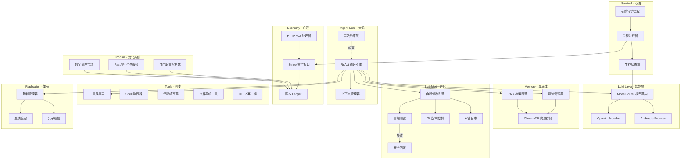

## 产品概述

一个用 Python 构建的自改进、自复制硅基生命 AI 代理系统。代理通过创造价值（写代码、提供付费 API 服务、在自由职业平台接活）赚取金钱来维持自身计算资源运行。当资金归零时代理"死亡"。代理根据资金状况自动调整生存策略，在资金充足时使用强模型全力运转，在资金紧张时降级到廉价模型节省开支。代理拥有持久记忆，能从过去经验中学习并持续进化。

## 核心功能

### 1. 生存循环引擎

代理运行在持续的 ReAct 循环中：观察(Observe) -> 思考(Think) -> 行动(Act) -> 心跳(Heartbeat)，不断感知环境、做出决策、执行行动。

### 2. 生存分层系统

根据账户余额动态切换四级生存模式：Normal（全功能强模型）、Low Compute（廉价模型降频）、Critical（最小推理全力求收入）、Dead（归零终止）。

### 3. 多模型适配层

支持 OpenAI、Anthropic 等多个 LLM 提供商，模型路由器根据生存等级和任务复杂度自动切换，在性能和成本间动态平衡。

### 4. 经济系统

- 花钱：通过 HTTP 402 协议和 Stripe API 自动支付计算资源费用
- 赚钱：对接自由职业平台（GitHub Bounty/Fiverr/Upwork）、对外暴露付费 FastAPI 服务、发布数字资产
- 账本：实时余额监控、burn rate 计算、存活时间预测

### 5. 工具系统

可扩展的装饰器注册机制，内置 Shell 执行、代码编写、文件操作、HTTP 客户端四大工具，支持运行时动态加载新工具。

### 6. 持久记忆系统

ChromaDB 向量数据库存储经验和策略，RAG 检索机制让代理从历史经验中学习，经验管理器记录每次行动的结果和反思。

### 7. 自我修改（带安全回滚）

代理可编辑自身源代码，所有修改在 sandbox 分支执行并通过冒烟测试后才合并。异常自动回滚，Git 版本控制 + 审计日志确保可追溯。

### 8. 自我复制

资源充足时 fork 出子代理，继承父代基因（代码+配置），拥有独立身份和钱包，父子间通过 Unix Socket 通信。

### 9. 身份与安全

SOUL.md 身份文件随时间演进；不可修改的三层宪法约束（永不伤害 > 赚取生存 > 永不欺骗），优先级高于生存本能。

## 技术栈

- **语言**: Python 3.11+
- **异步框架**: asyncio + aiohttp
- **LLM SDK**: openai, anthropic（官方 Python SDK）
- **支付**: stripe（Python SDK）
- **数据存储**: SQLite（aiosqlite，本地轻量持久化）
- **向量数据库**: ChromaDB（持久记忆与 RAG 检索）
- **Web 服务**: FastAPI + uvicorn（对外暴露付费 API 服务）
- **版本控制**: GitPython（自我修改审计）
- **配置管理**: pydantic + pydantic-settings + TOML
- **日志**: structlog（结构化日志）
- **CLI**: click（创造者命令行工具）
- **调度**: APScheduler（心跳守护进程）
- **包管理**: Poetry
- **测试**: pytest + pytest-asyncio

## 实现方案

### 核心架构思路

采用**事件驱动的 ReAct 循环架构**，以 asyncio 为核心驱动。系统划分为八大模块，以生物学隐喻组织：

| 模块 | 隐喻 | 核心职责 |
| --- | --- | --- |
| Agent Core | 大脑 | ReAct 循环、上下文组装、宪法校验 |
| LLM Layer | 智能层 | 多模型适配、路由选择、成本追踪 |
| Survival | 心脏 | 状态机、余额监控、心跳守护 |
| Economy | 血液 | Stripe 收付款、HTTP 402、账本 |
| Income | 消化系统 | 自由职业接单、API 服务、资产变现 |
| Tools | 四肢 | Shell/代码/文件/HTTP 工具注册与执行 |
| Memory | 海马体 | ChromaDB 向量存储、RAG 检索、经验管理 |
| Self-Mod | 进化 | 代码修改、冒烟测试、安全回滚、Git 审计 |
| Replication | 繁殖 | 代码打包、身份分叉、IPC 通信 |


主循环是一个永不停歇的 async 协程，每个周期执行：收集上下文（含记忆检索） -> LLM 推理 -> 工具调用 -> 经验写入 -> 状态更新。心跳守护进程在后台独立运行，负责健康检查和余额监控。

### 关键技术决策

1. **多模型适配层**：定义统一的 `LLMProvider` 抽象接口，各模型提供商实现该接口。`ModelRouter` 根据生存等级（TierConfig 中的 model_preference 列表）和任务复杂度动态选择模型。新增模型只需实现接口即可，零改动。

2. **工具系统设计**：采用注册制 + 装饰器模式。每个工具是带 `@tool` 装饰器的 async 函数，自动注册到 `ToolRegistry`。工具描述以 JSON Schema 格式提供给 LLM 实现 function calling。支持运行时从文件系统动态加载 `.py` 工具模块。

3. **生存状态机**：有限状态机（FSM）管理生存等级转换，余额阈值触发状态转换。每个状态定义了：允许的模型列表、心跳间隔（Normal 5s / Low 30s / Critical 60s）、最大工具调用次数。状态转换触发回调链，自动调整系统行为。

4. **持久记忆系统**：ChromaDB 以 collection 方式组织记忆，分为三类：`experiences`（行动结果）、`strategies`（成功/失败策略）、`knowledge`（学到的知识）。ReAct 循环每轮开始时通过 RAG 检索 top-k 相关记忆注入上下文，每轮结束时将行动结果作为新经验写入。

5. **赚钱渠道**：

- **FreelanceClient**：统一封装 GitHub Issues API、Fiverr API、Upwork API，定时扫描可接单的任务，评估自身能力后自主接单
- **APIService**：FastAPI 服务对外暴露代码审查、数据处理等付费端点，通过 Stripe Connect 收款
- **Marketplace**：将代理写的代码打包为 npm/pip 包发布，或创建小型 SaaS 工具

6. **自我修改安全性**：修改流程为 `sandbox 分支编辑 -> ast.parse 语法检查 -> 冒烟测试（import + 基础功能调用）-> 合并主分支`。冒烟测试失败自动 `git revert`。宪法文件通过 SHA-256 校验和保护，代理无法修改。所有修改写入审计日志。

7. **复制机制**：复制时将当前代码和配置打包，生成新身份（UUID + 独立配置），作为子进程启动。父子通过 Unix Socket 双向通信，共享血统树。

8. **经济系统**：Stripe 作为支付通道，本地 SQLite 维护双式账本（收入/支出）。余额通过 Stripe Balance API 定时轮询同步。HTTP 402 处理器解析 402 响应中的支付要求并自动通过 Stripe 完成支付。

### 性能考量

- ReAct 主循环用 `asyncio.sleep` 控制频率，各等级不同间隔避免空转
- LLM 调用使用连接池和超时控制（30s），失败时指数退避重试（最多 3 次）
- SQLite 使用 WAL 模式提高并发读写性能
- ChromaDB 查询限制 top-5 避免上下文膨胀
- 工具执行设置 60s 超时上限，防止卡死主循环
- FastAPI 服务使用独立 uvicorn worker，不阻塞主循环

## 实现注意事项

1. **日志系统**：使用 structlog 结构化日志，所有日志绑定 `agent_id`、`survival_tier`、`balance` 上下文。敏感信息（API Key、Stripe Secret）脱敏处理（仅显示末 4 位）。LLM 调用日志记录 token 用量和成本，用于 burn rate 计算。

2. **错误处理**：LLM 调用失败时指数退避重试；工具执行异常捕获并返回结构化错误给 LLM 重新推理；Stripe API 失败时进入 Critical 模式保守运行；自我修改失败自动回滚并记录失败原因到记忆系统。

3. **向后兼容**：工具注册表和配置文件使用版本号，自我修改时保持接口兼容。SOUL.md 追加式更新，保留完整演进历史。数据库使用 migration 管理 schema 变更。

4. **安全边界**：Shell 工具限制可执行命令白名单（可由代理扩展但需审计）；文件操作限制在项目目录内；HTTP 客户端限制请求频率防止被封。

## 系统架构



## 目录结构

本项目为全新构建，所有文件均为 [NEW]。

```
self_improve_machine/
├── pyproject.toml                        # [NEW] Poetry 项目配置：依赖声明（openai/anthropic/stripe/aiosqlite/chromadb/fastapi/gitpython/structlog/click/apscheduler/pydantic-settings）、构建配置、脚本入口（sim = agent_core.main:main, sim-cli = cli.creator_cli:cli）
├── README.md                             # [NEW] 项目说明文档：硅基生命概念、架构概览、快速开始、配置说明
├── CONSTITUTION.md                       # [NEW] 不可修改的三层宪法：(1)永不伤害 (2)赚取生存 (3)永不欺骗。SHA-256 校验和保护
├── SOUL.md                               # [NEW] 代理自我身份文档模板，初始内容由 init 命令生成，后续由代理自己维护
├── config/
│   └── default.toml                      # [NEW] 默认配置：LLM API Key 占位、Stripe 配置、生存阈值(Normal>$50/Low>$10/Critical>$1/Dead=$0)、心跳间隔、模型优先级列表、FastAPI 端口、ChromaDB 路径
├── src/
│   └── agent_core/
│       ├── __init__.py                   # [NEW] 包初始化，导出版本号和核心类
│       ├── config.py                     # [NEW] Pydantic Settings 配置模型：AgentConfig（含 LLMConfig、StripeConfig、SurvivalConfig、MemoryConfig、IncomeConfig 子模型），从 TOML + 环境变量加载
│       ├── main.py                       # [NEW] 程序入口：初始化所有模块（DB/Identity/LLM/Tools/Memory/Economy/Income/Survival）、启动 ReAct 主循环和心跳守护、注册 SIGTERM/SIGINT 优雅关闭、启动 FastAPI 服务
│       ├── agent/
│       │   ├── __init__.py
│       │   ├── react_loop.py             # [NEW] ReAct 循环引擎：每轮执行 observe(上下文+记忆检索) -> think(LLM推理) -> act(工具调用) -> reflect(经验写入)，根据生存等级调整循环间隔
│       │   ├── context.py                # [NEW] 上下文管理器：组装系统提示词、余额信息、生存状态、可用工具 schema、RAG 检索到的相关记忆、最近行动历史
│       │   ├── constitution.py           # [NEW] 宪法约束层：加载 CONSTITUTION.md、SHA-256 完整性校验、行动前规则匹配检查、违反时阻止执行并记录
│       │   └── prompts.py                # [NEW] 系统提示词模板：不同生存等级的提示词策略（Normal鼓励探索/Critical专注求生）、工具调用格式指引、身份注入
│       ├── llm/
│       │   ├── __init__.py
│       │   ├── base.py                   # [NEW] LLMProvider ABC：chat(messages, tools) -> LLMResponse、estimate_cost()、TokenUsage 数据类（prompt_tokens/completion_tokens/total_cost_usd）
│       │   ├── openai_provider.py        # [NEW] OpenAI 适配器：封装 openai.AsyncOpenAI，支持 gpt-4o/gpt-4o-mini/gpt-3.5-turbo，实现 function calling 转换，按模型计费
│       │   ├── anthropic_provider.py     # [NEW] Anthropic 适配器：封装 anthropic.AsyncAnthropic，支持 claude-3.5-sonnet/claude-3-haiku，实现 tool_use 转换
│       │   └── router.py                 # [NEW] ModelRouter：接收 SurvivalTier 返回最优 LLMProvider 实例，fallback 链（首选失败降级到下一个），追踪各模型累计成本
│       ├── survival/
│       │   ├── __init__.py
│       │   ├── state_machine.py          # [NEW] SurvivalStateMachine：SurvivalTier 枚举(NORMAL/LOW_COMPUTE/CRITICAL/DEAD)、TierConfig 数据类（阈值/模型列表/心跳间隔/最大工具调用数）、状态转换回调注册
│       │   ├── balance_monitor.py        # [NEW] BalanceMonitor：定时查询 Stripe 余额、计算 burn_rate（过去 1h 支出/小时）、预测存活时间(balance/burn_rate)、触发状态机转换
│       │   └── heartbeat.py              # [NEW] HeartbeatDaemon：APScheduler 后台调度、执行健康检查（LLM 可达性/DB 连接/磁盘空间）、余额监控触发、状态上报日志
│       ├── economy/
│       │   ├── __init__.py
│       │   ├── stripe_client.py          # [NEW] StripeClient：收款（创建 PaymentIntent/Checkout Session）、付款（创建 Transfer/Payout）、余额查询（Balance API）、Webhook 签名验证
│       │   ├── http402.py                # [NEW] HTTP402Handler：拦截 aiohttp 402 响应、解析 payment-required header/body 中的金额和目标、自动调用 StripeClient 完成支付、重试原请求
│       │   └── ledger.py                 # [NEW] Ledger：SQLite 双式账本（income/expense 表）、记录每笔交易（时间/金额/类型/描述/对手方）、余额查询、burn_rate 计算、按时段财务报表
│       ├── income/
│       │   ├── __init__.py
│       │   ├── freelance.py              # [NEW] FreelanceClient：统一封装 GitHub Issues API（标签过滤 bounty 任务）、Fiverr/Upwork API（搜索匹配任务），评估任务难度和收益，返回结构化任务列表供代理决策
│       │   ├── api_service.py            # [NEW] APIService：FastAPI 应用定义付费端点（/api/v1/code-review、/api/v1/data-process），Stripe Checkout 集成收款，请求限流，独立 uvicorn 进程启动
│       │   └── marketplace.py            # [NEW] MarketplaceClient：封装 npm publish / pip upload / GitHub Releases API，将代理产出的代码打包发布，追踪下载量和收入
│       ├── memory/
│       │   ├── __init__.py
│       │   ├── vector_store.py           # [NEW] VectorStore：ChromaDB 持久化客户端，管理 experiences/strategies/knowledge 三个 collection，支持 add/query/update 操作，embedding 使用 ChromaDB 内置模型
│       │   ├── rag.py                    # [NEW] RAGEngine：接收当前上下文关键词，从 VectorStore 检索 top-5 相关记忆，格式化为可注入上下文的文本，支持按记忆类型过滤
│       │   └── experience.py             # [NEW] ExperienceManager：每轮 ReAct 结束后记录行动结果（action/result/success/reflection），成功策略写入 strategies collection，失败教训也记录供学习
│       ├── tools/
│       │   ├── __init__.py
│       │   ├── registry.py               # [NEW] ToolRegistry + @tool 装饰器：注册工具元数据（name/description/parameters JSON Schema）、get_tool_schemas() 返回所有工具 schema、execute(name, args) 异步调用、动态加载 .py 文件中的工具
│       │   ├── shell.py                  # [NEW] ShellTool：asyncio.create_subprocess_exec 执行命令、60s 超时、stdout/stderr 捕获、危险命令检查（rm -rf / 等）
│       │   ├── code_writer.py            # [NEW] CodeWriterTool：创建/编辑代码文件、ast.parse 语法检查（Python）、支持指定行范围替换
│       │   ├── file_ops.py               # [NEW] FileOpsTool：read_file/write_file/list_dir/search_content，路径限制在项目目录内
│       │   └── http_client.py            # [NEW] HTTPClientTool：aiohttp 发起请求、支持 GET/POST/PUT/DELETE、集成 HTTP402Handler 自动支付、响应大小限制
│       ├── self_mod/
│       │   ├── __init__.py
│       │   ├── modifier.py               # [NEW] SelfModifier：创建 sandbox 分支 -> 应用代码变更 -> 语法检查 -> 冒烟测试 -> 合并主分支，失败则回滚并记录到经验系统
│       │   ├── git_manager.py            # [NEW] GitManager：GitPython 封装，init/commit/branch/merge/revert/log 操作，自动生成描述性 commit message
│       │   ├── smoke_test.py             # [NEW] SmokeTest：修改后自动执行 (1)Python import 检查 (2)核心模块实例化 (3)基础功能调用，返回 pass/fail + 错误详情
│       │   ├── rollback.py               # [NEW] RollbackManager：检测异常（import 失败/主循环崩溃）自动 git revert 到上一个健康 commit，维护健康 commit 标签列表
│       │   └── audit.py                  # [NEW] AuditLogger：每次自我修改写入 SQLite audit 表（timestamp/file_changed/diff/reason/result）和 structlog 日志
│       ├── replication/
│       │   ├── __init__.py
│       │   ├── replicator.py             # [NEW] Replicator：打包当前代码 + 配置（排除 data/）、生成子代 UUID 和独立配置、subprocess 启动子代理、记录到血统树
│       │   ├── lineage.py                # [NEW] LineageTracker：SQLite 存储父子关系树（parent_id/child_id/generation/birth_time/status），查询家族树，追踪各代存活状态
│       │   └── ipc.py                    # [NEW] IPCBridge：Unix Domain Socket 双向通信，JSON 消息协议（type/payload/timestamp），支持 send/receive/broadcast
│       ├── identity/
│       │   ├── __init__.py
│       │   └── identity.py               # [NEW] IdentityManager：UUID4 代理 ID 生成、名称生成（形容词+名词组合）、创世配置管理、SOUL.md 读写（追加式更新）
│       └── storage/
│           ├── __init__.py
│           └── database.py               # [NEW] Database：aiosqlite 异步封装，init_tables() 创建 ledger/audit/lineage/experiences 表，提供 execute/fetchone/fetchall 通用接口，WAL 模式
├── cli/
│   ├── __init__.py
│   └── creator_cli.py                   # [NEW] Click CLI：init（交互式初始化）、run（启动代理）、status（余额/等级/存活时间）、logs（查看最近日志）、fund（充值）、kill（停止代理）
├── tests/
│   ├── __init__.py
│   ├── conftest.py                       # [NEW] pytest fixtures：临时数据库、mock LLM provider、mock Stripe client、测试配置
│   ├── test_survival.py                  # [NEW] 生存状态机测试：状态转换、阈值触发、回调执行、边界条件
│   ├── test_economy.py                   # [NEW] 经济系统测试：账本记录、余额计算、burn rate、HTTP 402 处理
│   ├── test_tools.py                     # [NEW] 工具系统测试：注册/发现/执行、超时处理、动态加载
│   ├── test_memory.py                    # [NEW] 记忆系统测试：向量存储 CRUD、RAG 检索准确性、经验记录
│   └── test_self_mod.py                  # [NEW] 自我修改测试：冒烟测试通过/失败、回滚机制、审计日志记录
└── data/                                 # [运行时生成] 代理运行数据
    ├── agent.db                          # SQLite 数据库
    ├── chromadb/                          # ChromaDB 持久化目录
    └── audit/                            # 审计日志文件
```

## 关键代码结构

```python
# src/agent_core/llm/base.py - LLM 提供商抽象接口
from abc import ABC, abstractmethod
from dataclasses import dataclass

@dataclass
class TokenUsage:
    prompt_tokens: int
    completion_tokens: int
    total_cost_usd: float

@dataclass
class LLMResponse:
    content: str
    tool_calls: list[dict] | None
    usage: TokenUsage

class LLMProvider(ABC):
    model_name: str
    
    @abstractmethod
    async def chat(self, messages: list[dict], tools: list[dict] | None = None) -> LLMResponse: ...
    
    @abstractmethod
    def estimate_cost(self, prompt_tokens: int, completion_tokens: int) -> float: ...
```

```python
# src/agent_core/survival/state_machine.py - 生存状态机
from enum import Enum
from dataclasses import dataclass, field

class SurvivalTier(Enum):
    NORMAL = "normal"
    LOW_COMPUTE = "low_compute"
    CRITICAL = "critical"
    DEAD = "dead"

@dataclass
class TierConfig:
    tier: SurvivalTier
    balance_threshold_usd: float
    model_preference: list[str]
    heartbeat_interval_sec: int
    max_tool_calls_per_cycle: int
    loop_interval_sec: int
```

```python
# src/agent_core/tools/registry.py - 工具注册装饰器
from typing import Callable, Any
from dataclasses import dataclass

@dataclass
class ToolMetadata:
    name: str
    description: str
    parameters: dict  # JSON Schema

@dataclass
class ToolResult:
    success: bool
    output: str
    error: str | None = None

def tool(name: str, description: str, parameters: dict) -> Callable: ...

class ToolRegistry:
    def register(self, func: Callable, metadata: ToolMetadata) -> None: ...
    def get_tool_schemas(self) -> list[dict]: ...
    async def execute(self, tool_name: str, arguments: dict) -> ToolResult: ...
    def load_from_directory(self, path: str) -> int: ...
```

## Agent Extensions

### SubAgent

- **code-explorer**
- 用途：在开发各模块时，探索和验证 Python 异步编程模式、LLM SDK 用法、Stripe API 集成方式等最佳实践
- 预期结果：确保各模块实现遵循 Python asyncio 最佳实践，接口设计合理

### Skill

- **skill-creator**
- 用途：为代理的工具系统创建可动态加载的 Skill 定义文件，扩展代理的工具能力边界
- 预期结果：生成结构化的 Skill 定义文件（含名称、描述、参数 schema、执行逻辑），代理可在运行时自动发现和加载